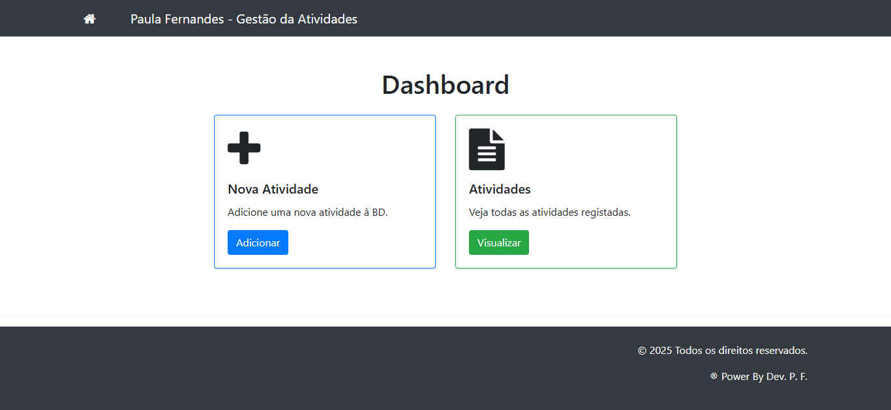
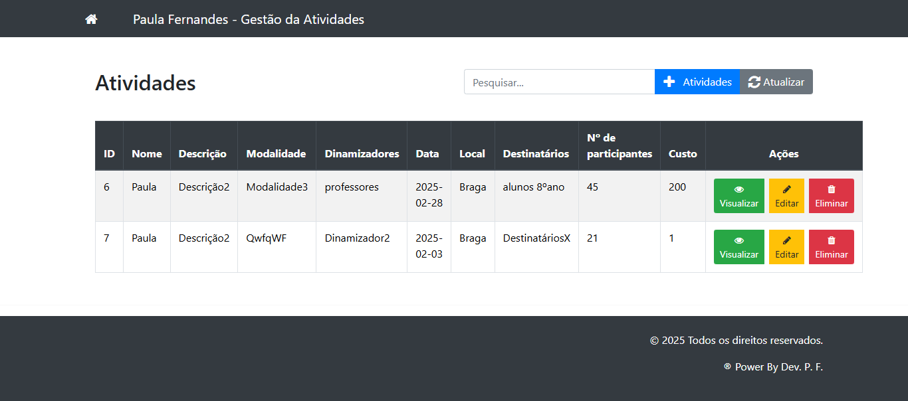
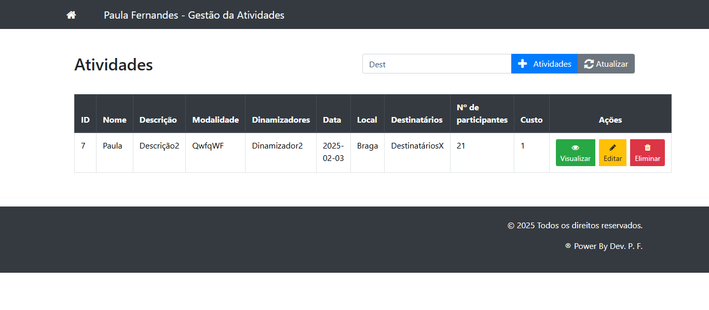
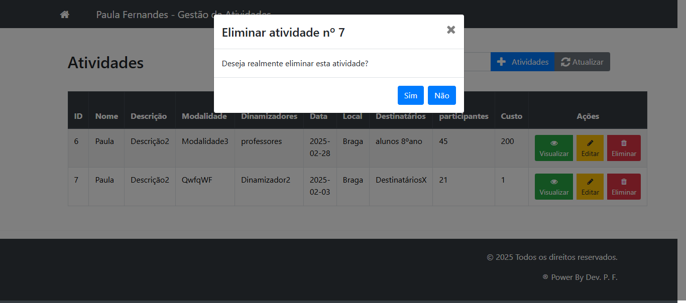
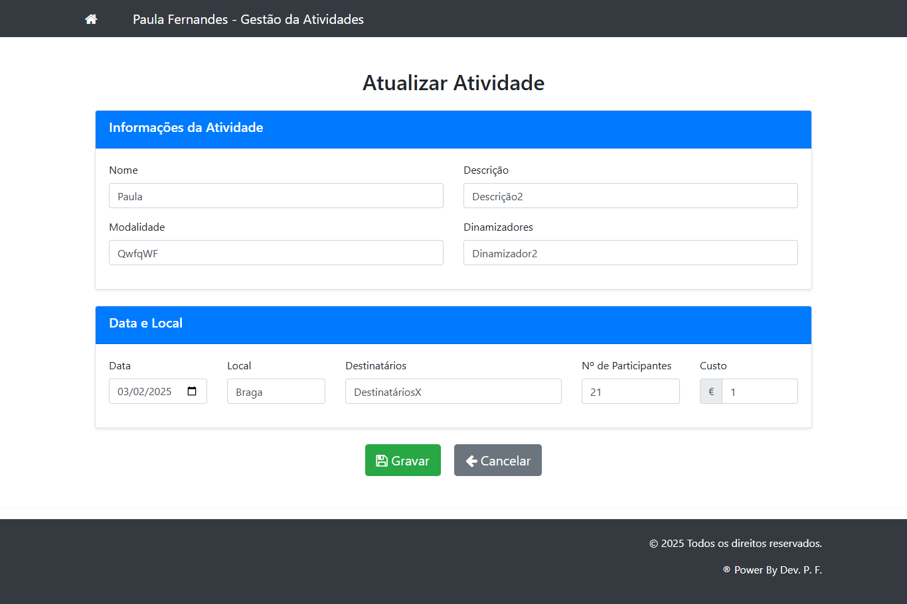

***🎓 Plataforma de Gestão de Atividades Educativas***
*** ***


📘 Simplifica. 📊 Organiza. 🚀 Automatiza.

Adaptado às realidades educativas.

---

Um sistema web construído em PHP para facilitar a gestão de atividades escolares e académicas. 

Permite o registo, consulta, edição e eliminação de atividades de forma intuitiva, moderna e organizada.

---

***🚀 FUNCIONALIDADES PRINCIPAIS***

• Registo de novas atividades  
• Listagem de todas as atividades registadas  
• Visualização detalhada de cada atividade  
• Edição de atividades existentes  
• Eliminação de atividades  
• Pesquisa dinâmica em tempo real  
• Registo e visualização de erros do sistema  

---

***💻 TECNOLOGIAS UTILIZADAS***

• PHP 7.4+  
• MySQL  
• Bootstrap 5.3.2  
• jQuery 3.6.0  
• Font Awesome 4.6.2  
• SweetAlert  

---

***📋 PRÉ-REQUISITOS***

• Servidor web (ex: Apache ou Nginx)  
• PHP 7.4 ou superior  
• MySQL 5.7 ou superior  
• Extensão `mysqli` do PHP ativa  

---

***🛠️ COMO INSTALAR***

1. Clonar o repositório:
```bash
git clone https://github.com/smpsandro1239/projatividades_crud_bootstrap_php2.git
````

2. Criar a base de dados no MySQL:

```sql
CREATE DATABASE gestao_atividades;
USE gestao_atividades;

CREATE TABLE atividades (
    id INT AUTO_INCREMENT PRIMARY KEY,
    nome VARCHAR(255) NOT NULL,
    descricao TEXT,
    modalidade VARCHAR(100),
    dinamizadores VARCHAR(255),
    data DATE,
    local VARCHAR(255),
    destinatarios VARCHAR(255),
    numero_participantes INT,
    custo DECIMAL(10,2)
);
```

3. Configurar a ligação à base de dados no ficheiro `config.php`:

```php
define('DB_NAME', 'gestao_atividades');
define('DB_USER', 'o_teu_utilizador');
define('DB_PASSWORD', 'a_tua_senha');
define('DB_HOST', 'localhost');
```

4. Copiar os ficheiros para o diretório do servidor (ex: `htdocs` do XAMPP)
5. Aceder no navegador: `http://localhost/projatividades_crud_bootstrap_php2`

---

***📂 ESTRUTURA DO PROJETO***

```
projatividades_crud_bootstrap_php2/
│
├── atividades/
│   ├── add.php         → Adicionar atividade
│   ├── delete.php      → Eliminar atividade
│   ├── edit.php        → Editar atividade
│   ├── functions.php   → Funções auxiliares
│   ├── index.php       → Listagem de atividades
│   ├── modal.php       → Janela modal
│   └── view.php        → Visualização detalhada
│
├── css/
│   └── Estilos e personalizações
│
├── inc/
│   ├── database.php    → Ligação com a base de dados
│   ├── footer.php      → Rodapé
│   └── header.php      → Cabeçalho
│
├── config.php          → Configuração principal
└── index.php           → Página principal
```

---

***📊 FUNCIONALIDADES DETALHADAS***

**Painel Principal**

• Visão geral das atividades
• Acesso rápido às opções principais

**Gestão de Atividades**

• Formulário com validação de campos obrigatórios
• Edição e eliminação com alertas de confirmação
• Gestão de datas e custos associáveis

**Gestão de Erros**

• Registo automático de erros em ficheiro
• Interface limpa para diagnóstico

---

***🔒 SEGURANÇA***

• Proteção contra SQL Injection com `mysqli`

• Sanitização de entradas do utilizador

• Validação robusta no lado do servidor

---

***📸 EXEMPLOS DO FUNCIONAMENTO***

| Funcionalidade         | Imagem                                                                                                                             |
| ---------------------- | ---------------------------------------------------------------------------------------------------------------------------------- |
| Página Principal       |                  |
| Listagem de Atividades |     |
| Pesquisa de Atividades |     |
| Detalhes de Atividade  |     |
| Confirmação de Ação    |  |
| Edição de Atividade    |        |

---

***📈 MELHORIAS FUTURAS***

☐ Sistema de autenticação e início de sessão

☐ Exportação de dados em PDF ou Excel

☐ Relatórios gráficos com estatísticas

☐ Interface adaptada a dispositivos móveis

---

***👤 AUTOR***

Desenvolvido por **Sandro Pereira**

Repositório: [github.com/smpsandro1239](https://github.com/smpsandro1239)

---

***📄 LICENÇA***

Este projeto está disponível sob a licença MIT.

Consulta o ficheiro [LICENSE.md](LICENSE.md) para mais informações.

---

***🎁 AGRADECIMENTOS***

• A todas as comunidades open-source envolvidas

• A projetos que serviram de inspiração para este CRUD

---

***💡 Contribui ou dá feedback!***

Este projeto é de código aberto — sugestões, melhorias e forks são bem-vindos.

Vamos tornar a gestão educativa mais eficiente — juntos!


---


⌨️ Desenvolvido com dedicação e paixão por 


***Sandro Pereira*** 🇵🇹
